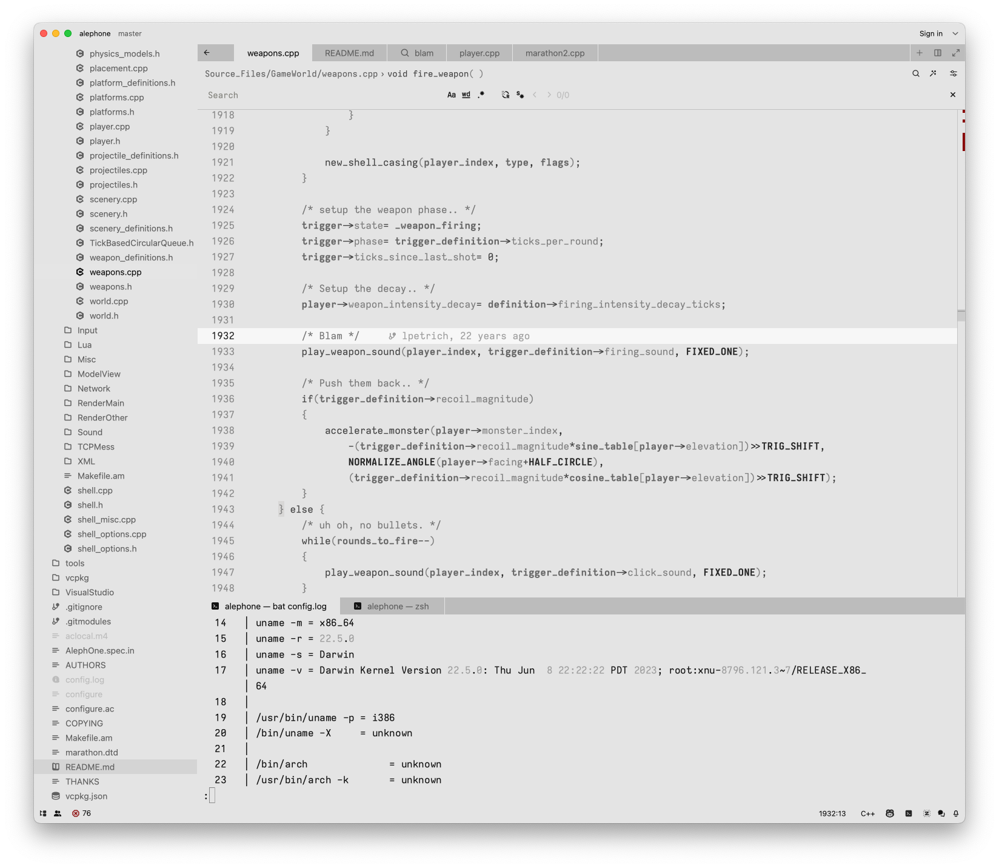

# Monosami

98% black and white monochrome theme for Zed Editor

Inspired by: https://github.com/pgdouyon/vim-yin-yang/tree/master?tab=readme-ov-file
 
Installation can de done by adding new extension in Zed app. For manual installation for this guide: https://zed.dev/blog/user-themes-now-in-preview
 
 

### Screenshots

